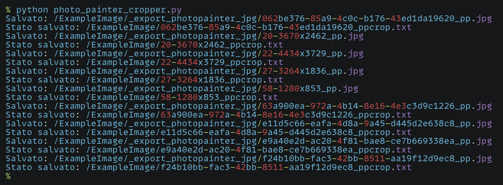
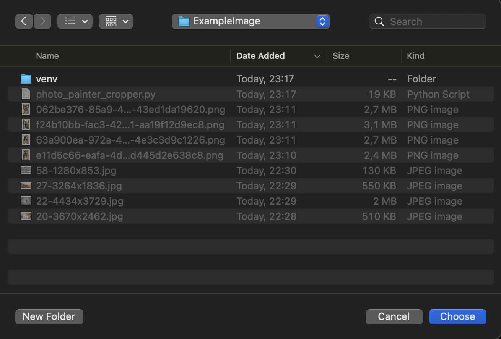
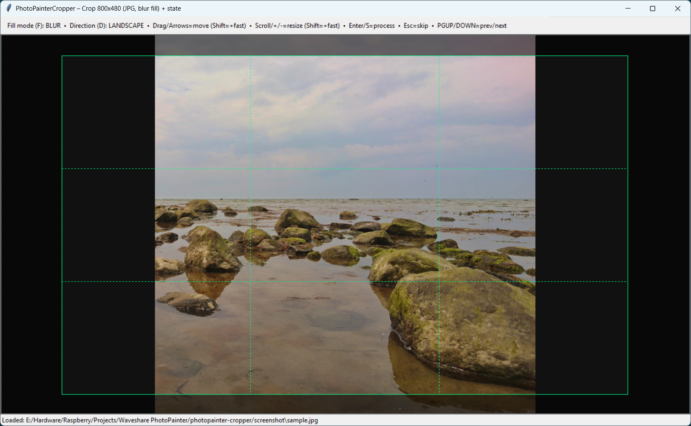
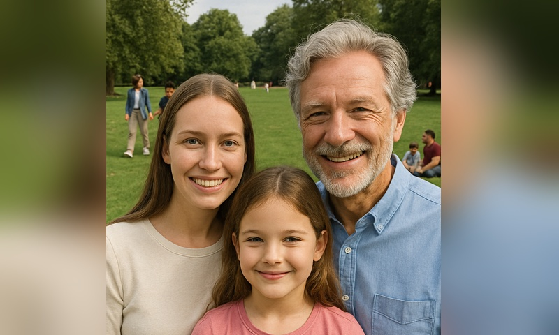
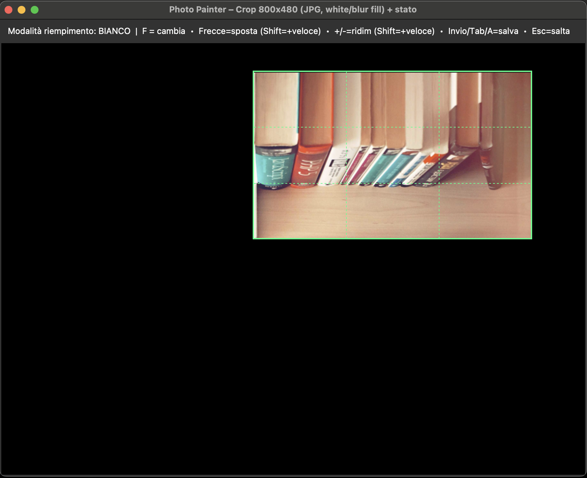
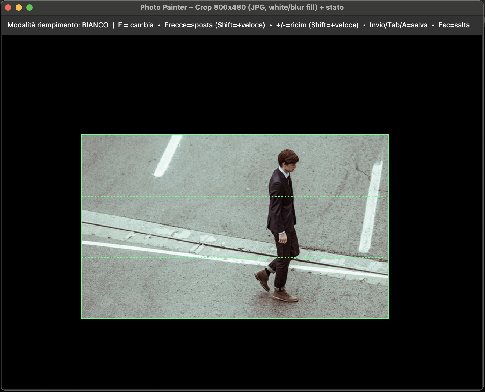
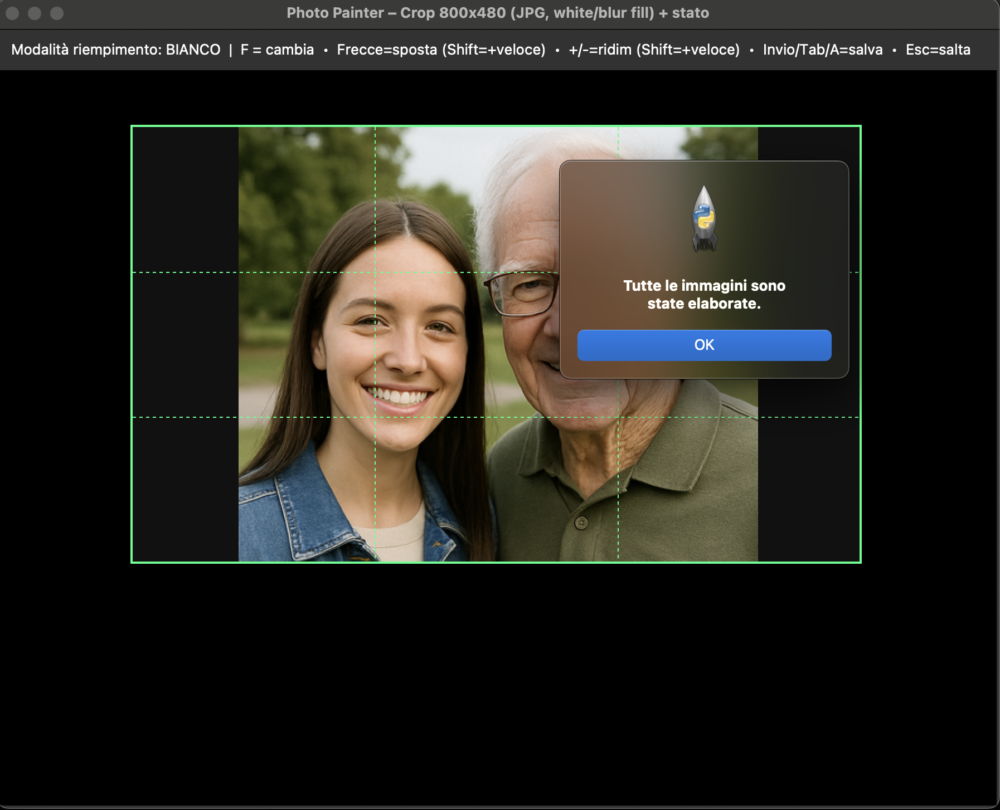

# PhotoPainter Cropper (macOS)

Interactive cropper for the **Waveshare PhotoPainter** (7.3" ACeP,
800×480).

This tool helps you frame the most important area of each photo with a
fixed **800:480** ratio. The crop rectangle may extend **outside** the
image; the empty area is filled with **White** or an auto-generated
**Blurred background**. It was written for my personal workflow on
**macOS**.

The app exports **JPG 800×480** (landscape). For the final device format
(**24-bit BMP**), I use Waveshare’s **official converter**, which
provides better color/tonal results on the 7-color panel than a plain
BMP export.

<figure class="align-center">

<figcaption>Batch run: every Save creates a JPG and a per-image state
file (<code>*_ppcrop.txt</code>).</figcaption>
</figure>

<figure class="align-center">

</figure>

If you crop beyond the border, the image looks like this:

<figure class="align-center">

</figure>

Which becomes:

<figure class="align-center">

</figure>

an the results after cnversion is something like this (obviously is different seen from the photopainter):

<figure class="align-center">

</figure>

Obviously image inside the rectangle remain as they are, just zoommed:

<figure class="align-center">

</figure>

<figure class="align-center">

</figure>

<figure class="align-center">

</figure>

## Key Features

- Fixed **800:480** crop ratio (landscape).
- Crop can go **out of image bounds**; fill with **White** or **Blur**
  (toggle `F`).
- **Per-image state**: saving writes `*_ppcrop.txt` next to the original
  image; running again restores the exact rectangle automatically (great
  for large batches).
- **Mouse**: drag to move, scroll to resize.
- **Keyboard**:
  - Arrows = move (hold **Shift** = faster)
  - `+` / `-` = resize (hold **Shift** = faster)
  - **Enter**, **Tab**, or **A** = save current and go to next
  - **F** = toggle fill (White ↔ Blur)
  - **Esc** = skip image
- Crisp grid lines aligned to device pixels (look straight on Retina).

## Why JPG first, then BMP?

I tested direct BMP export that follows the device format, but the
images looked a bit **flat**. The official Waveshare converter applies
**dithering** and other processing, and it **looks better on the
PhotoPainter**.

Typical workflow:

1.  Use this app to export **JPG 800×480**.
2.  Convert JPG → **24-bit BMP** using the official Waveshare converter.
3.  Copy BMPs to the SD card.

## Samples and Outputs Included

- Example **input** photos (both portrait and landscape) live under
  `samples/`.
- Example **outputs** from this tool (JPG 800×480) are available under
  `_export_photopainter_jpg/`.
- For convenience, this repository may also include **BMP files**
  created with Waveshare’s converter inside the same
  `_export_photopainter_jpg/` folder, so testers can copy them directly
  to the device.

## Device SD Card Layout

- Create a folder named `pic` at the **root** of the SD card.
- Copy all **24-bit BMP** files inside `pic`.
- Stock firmware expects fewer than ~100 images in `pic`.
- I personally use a **custom firmware** (not mine) by `@tcellerier`
  that supports **up to 2000 photos**.

## Install (macOS)

Use the **official** Python for macOS (includes Tkinter).

``` bash
/Library/Frameworks/Python.framework/Versions/3.12/bin/python3 -m venv ~/ppainter-venv
source ~/ppainter-venv/bin/activate
python -m pip install --upgrade pip
pip install -r requirements.txt
```

## Run

``` bash
source ~/ppainter-venv/bin/activate
python photo_painter_cropper.py
```

- Supported inputs: `.jpg`, `.jpeg`, `.png`, `.bmp`, `.tif`, `.webp`.
- Use mouse/keyboard to position and size the rectangle.
- Press **Enter / Tab / A** to save and go to the next.
- Output JPGs go to `_export_photopainter_jpg/` next to your originals.
- A `*_ppcrop.txt` file is written next to each original to **remember**
  the crop.

## Project Type (GitHub Topics)

Desktop GUI **application** (Tkinter) for macOS. Suggested topics:
`app`, `desktop`, `gui`, `tkinter`, `pillow`, `macos`,
`image-processing`, `photopainter`, `waveshare`, `e-paper`.

## References

- Waveshare **PhotoPainter wiki** (specs, formats, conversion tools)
  <https://www.waveshare.com/wiki/PhotoPainter>
- Official **JPEG→BMP converter** (PhotoPainter_B)
  <https://github.com/waveshareteam/PhotoPainter_B>
- Custom firmware (not mine) by **@tcellerier** — up to **2000** photos
  <https://github.com/tcellerier/Pico_ePaper_73>
- My site <https://geegeek.github.io/>

## License & Credits

- License: **MIT**.
- Not affiliated with Waveshare. All trademarks belong to their owners.
- Firmware credit: **@tcellerier** (see link above).
