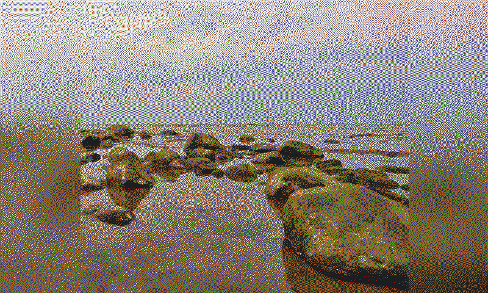
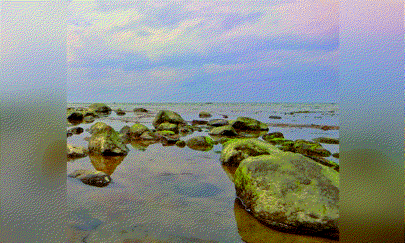

# PhotoPainter Cropper (macOS & Windows)

Interactive cropper for the **Waveshare PhotoPainter** (7.3" ACeP, 800×480).

This project is a fork of [@geegeek](https://github.com/geegeek)/[photopainter-cropper](https://github.com/geegeek/photopainter-cropper). Much improved.

This tool helps you frame the most important area of each photo in a given folder with a fixed **800x480** (landscape) or **480x800** (portrait) ratio. The crop rectangle may extend **outside** of the image and the empty area is filled with **white** or an auto-generated **blurred background**. It was written for the personal workflow by **@geegeek** on **macOS** and improved with additional features. It now works on **Windows**, too.

The app exports **JPG 800×480** (landscape) or **480:800** (portrait) by setting the direction in the app. For the final **24-bit BMP** device format, it uses some modified code of a Gist by **@quark-zju** with a color map from [epdoptimize](https://github.com/Utzel-Butzel/epdoptimize), which provides way better color/tonal results on the 7-color panel than a plain BMP export by the original Waveshare converter.

## How it works

A sample image:

<figure class="align-center">

</figure>

...cropped beyond the border:

<figure class="align-center">

</figure>

...becomes this image as JPG:

<figure class="align-center">

</figure>

...converts to a dithered BMP:

<figure class="align-center">

</figure>

...and finally maps to a device specific color palette (Waveshare PhotoPainter Pico ACeP 7-color):
<figure class="align-center">

</figure>

...which looks like this on the PhotoPainter:
<figure class="align-center">

</figure>

## Key Features

- Fixed **800x480** (landscape) or **480x800** (portrait) crop ratio.
- Crop can go **out of image bounds** and fill with **White** or **Blur** background
  (toggle `F`).
- **Per-image state**: a sidecar file with `*_ppcrop.txt` next to the original
  image is saved; running the app again restores the exact rectangle automatically (great
  for large batches).
- **Mouse**: drag to move, scroll to resize (hold **Shift** = faster).
- **Keyboard**:
  - Arrows = move (hold **Shift** = faster)
  - `+` / `-` = resize (hold **Shift** = faster)
  - **Enter** or **S** = process & save current image and go to next
  - **F** = toggle fill (White ↔ Blur)
  - **D** = toggle direction (landscape ↔ portrait)
  - **ESC** = skip current image
  - **PAGE_UP** = previous image without processing current image
  - **PAGE_DOWN** = next image without processing current image
- Crisp grid lines aligned to device pixels (look straight on Retina).

---
- Supported image types: `.jpg`, `.jpeg`, `.png`, `.bmp`, `.tif`, `.tiff`, `.webp`.
- Use **mouse/keyboard** to position and size the crop rectangle.
- Press **Enter / S** to save and go to the next image.
- A `*_ppcrop.txt` file is written next to each original to **remember** the crop.
- **Cropped JPGs** are saved to `cropped_landscape|cropped_portrait` next to your originals.
- **Converted BMP** images are saved to `cropped_landscape|cropped_portrait/converted` next to your originals.
- **Converted Real-color BMP** images are saved to `cropped_landscape|cropped_portrait/converted/device` next to your originals.

## Why JPG first, then BMP?

I tested direct BMP export that follows the device format, but the
images looked a bit **flat**. The official Waveshare converter applies
**dithering** and other processing, and it **looks a lot better on the
PhotoPainter**.

Using this app does the following:

1. Scale and Crop with export to **JPG 800×480 / 480x800**.
2. Convert JPG → **24-bit BMP** using the internal converter.
3. Convert 24-bit BMP → Real world ePaper Screen RGB with color map from epdoptimize

## Samples and Outputs included

- Example **input** photo and **outputs** from this tool (JPG 800×480) are available in `sample` folder.
- For convenience, this repository also includes **BMP files** created with Waveshare’s converter in `sample/cropped_landscape/pic/device` folder, so testers can copy them directly to the device.

## Device SD Card layout

- Create a folder named `pic` at the **root** of the SD card.
- Copy all **24-bit BMP** files into this `pic` folder.
- Stock firmware expects fewer than ~100 images in `pic`.
- I personally use a **custom firmware** (not mine) by `@tcellerier` that supports **up to 2000 photos**.

## Install (macOS)

Use the **official** Python for macOS (includes Tkinter).

``` bash
/Library/Frameworks/Python.framework/Versions/3.12/bin/python3 -m venv ~/ppainter-venv
source ~/ppainter-venv/bin/activate
python -m pip install --upgrade pip
pip install -r requirements.txt
```

## Run

### MacOS

``` bash
source ~/ppainter-venv/bin/activate
python photo_painter_cropper.py
```

### Windows
``` bash
# git clone, jump into directory and install requirements
git clone https://github.com/geegeek/photopainter-cropper.git
cd photopainter-cropper
# create virtual environment for project (also creates folder by name)
python -m venv .venv
# create .venv\.gitignore with content "*"
# install and update PIP
python -m pip install --upgrade pip
# install requirements
python -m pip install -r requirements.txt
.\.venv\Scripts\activate
# it now says
(.venv) PS patzh\to\photopainter-cropper>
# run script
python photo_painter_cropper.py
# build executable and generate `.spec` file
pyinstaller --onefile --windowed -i='.\_source\icon.ico' --add-data "_source/icon.ico;_source" --name "PhotoPainterCropper" ".\photo_painter_cropper.py"
# later you can run compilation with:
pyinstaller PhotoPainterCropper.spec
# quit venv
deactivate
```

## Project Type (GitHub Topics)

Desktop GUI **application** (Tkinter) for macOS. Suggested topics:
`app`, `desktop`, `gui`, `tkinter`, `pillow`, `macos`,
`image-processing`, `photopainter`, `waveshare`, `e-paper`.

## References

- Waveshare [PhotoPainter wiki](https://www.waveshare.com/wiki/PhotoPainter) (specs, formats, conversion tools)
- Official **JPEG→BMP converter** [@waveshareteam](https://github.com/waveshareteam)/[PhotoPainter_B](https://github.com/waveshareteam/PhotoPainter_B)
- **UI/App** forked from [@geegeek](https://github.com/geegeek)/[photopainter-cropper](https://github.com/geegeek/photopainter-cropper)
- inspired from [@quark-zju](https://gist.github.com/quark-zju)/[epd-dither-resize-spectra6.py](https://gist.github.com/quark-zju/e488eb206ba66925dc23692170ba49f9) image processor Gist
- Usage of [device color palette](https://github.com/Utzel-Butzel/epdoptimize/blob/main/src/dither/data/default-palettes.json) from [@Utzel-Butzel](https://github.com/Utzel-Butzel)/[epdoptimize](https://github.com/Utzel-Butzel/epdoptimize/)
- **Custom firmware** by [@tcellerier](https://github.com/tcellerier)/[Pico_ePaper](https://github.com/tcellerier/Pico_ePaper_73) — up to **2000** photos

## License & Credits

- License: **MIT**
- Not affiliated with Waveshare. All trademarks belong to their owners.
- Firmware credit: **@tcellerier** (see link above).
