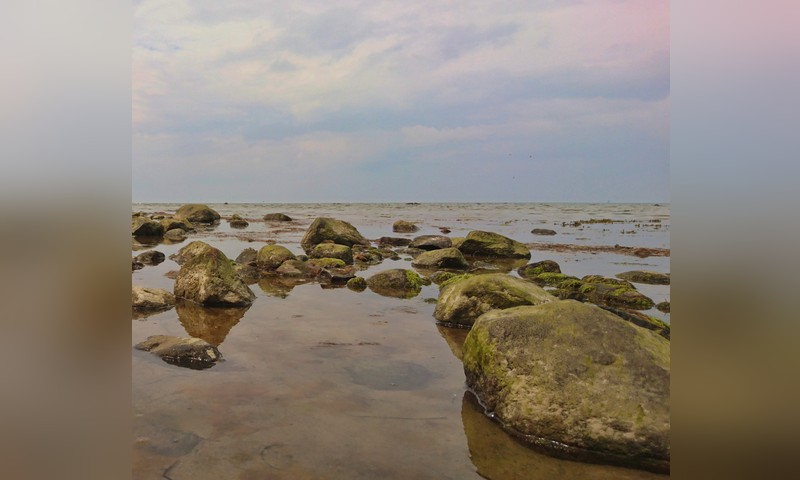
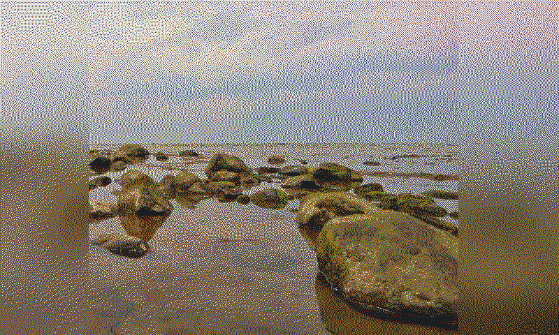
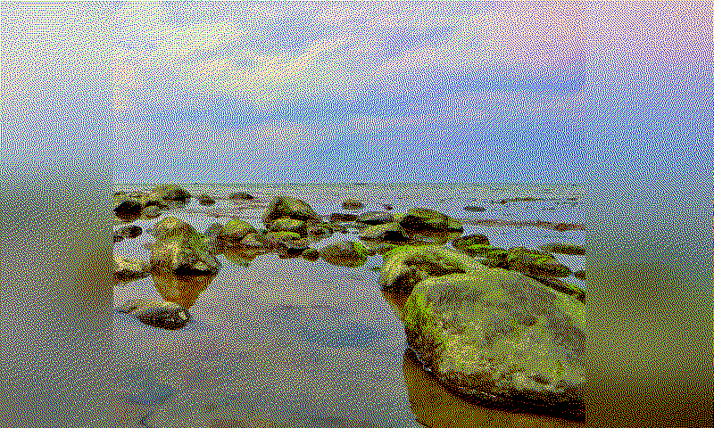

# PhotoPainter Cropper (macOS & Windows)

Interactive cropper for the **Waveshare PhotoPainter** 7.3" ACeP and Spectra6 version.

This project is a fork of [@geegeek](https://github.com/geegeek)/[photopainter-cropper](https://github.com/geegeek/photopainter-cropper). Much improved.

This tool helps you frame the most important area of each photo in a given folder with a fixed **800x480** (landscape) or **480x800** (portrait) ratio. The crop rectangle may extend **outside** of the image and the empty area is filled with **white** or an auto-generated **blurred background** from the image. It was written for the personal workflow by **@geegeek** on **macOS** and improved with additional features. It now works on **Windows** and **Linux**, too.

## How it works

A sample image:

<figure class="align-center">

</figure>

...cropped beyond the border:

<figure class="align-center">

</figure>

...becomes this image as JPG:

<figure class="align-center">

</figure>

...converts to a dithered BMP:

<figure class="align-center">

</figure>

...and finally maps to a device specific color palette (Waveshare PhotoPainter Pico ACeP 7-color) which looks much punchier on your computer screen:
<figure class="align-center">

</figure>

...but much right when displayed on the PhotoPainter itself:
<figure class="align-center">

</figure>

## Key Features

- Load image by **EXIF** orientation
- Fixed **800x480** (landscape) or **480x800** (portrait) crop ratio.
- **ACeP** or **Spectra6** optimized output.
- **Color** or **Monochrome**
- Crop can go **out of image bounds** and fill with **White** or **Blur** background (toggle `F`).
- **Per-image state**: a sidecar file with `*_ppcrop.txt` next to the original image is saved; running the app again restores the exact rectangle automatically (great for large batches).
- **Mouse**: drag to move, scroll to resize (hold **Shift** = faster).
- **Keyboard**:
  - Arrows = move (hold **Shift** = faster)
  - `+` / `-` = resize (hold **Shift** = faster)
  - **Enter** or **S** = process & save current image and go to next
  - **F** = toggle fill (White ↔ Blur)
  - **D** = toggle direction (landscape ↔ portrait)
  - **ESC** = skip current image
  - **PAGE_UP** = previous image without processing current image
  - **PAGE_DOWN** = next image without processing current image
- Crisp grid lines aligned to device pixels (look straight on Retina).
- Supported image types: `.jpg`, `.jpeg`, `.png`, `.bmp`, `.gif`, `.tif`, `.tiff`, `.webp`.
- Use **mouse/keyboard** to position and size the crop rectangle.
- Press **Enter / S** to save and go to the next image.
- A `*_ppcrop.txt` "sidecar" file is written next to each original image to **remember** the individual setting (orientation, fill mode, color mode, target device and dimensions).
- **Cropped JPGs** are saved to `cropped_landscape|cropped_portrait` next to your originals.
- **Converted BMP** images are saved to `cropped_landscape|cropped_portrait/dithered` next to your originals.
- **Converted Real-color BMP** images are saved to `cropped_landscape|cropped_portrait/dithered/device/[acep|spectra6]` next to your originals.

## Why all these steps?

Using the direct BMP export that follows the device format by using the suggested 6-/7-color palette rendering the images look a bit **flat** on the device, somehow like a vintage filter. This app applies **dithering** and **color mapping** and the result **looks a lot better** on the PhotoPainter device.

This app does the following:

1. **Scale and Crop.**
   In the first step, the app exports to **JPG 800×480** (landscape) or **480x800** (portrait) by setting the direction in the app.
2. **Convert JPG → 24-bit BMP**.
   In the second step the image will be dithered with the Floyd-Steinberg dithering algorithm and saved in a subfolder.
3. **Convert 24-bit BMP → Real world ePaper Screen RGB**.
   For the final 24-bit BMP device format, it uses part of a Gist by **@quark-zju** with color maps from [epdoptimize](https://github.com/Utzel-Butzel/epdoptimize). It provides way better color/tonal results on the 6- and 7-color panels than a plain BMP export by the original Waveshare converter.

## Samples and Outputs included

- Example **input** photo and **outputs** from this tool (JPG 800×480) are available in `sample` folder.
- For convenience, this repository also includes **BMP files** created with this converter in `sample/cropped_landscape/dithered/device/acep` folder, so you can copy them directly to the device.

## Device SD Card layout

- Create a folder named `pic` at the **root** of the SD card.
- Copy all **24-bit BMP** files from your desired target device folder into this `pic` folder.
- Stock firmware expects fewer than ~100 images in `pic` folder.
- I personally use a **custom firmware** for my 7-color ACeP version, a mix of the official Waveshare firmware with improvements from @myevit made for the Spectra6 firmware which supports nearly **unlimited photos** in theory. Practically it has *"a reasonable limit to prevent memory issues"* of **100.000** photos.

## Install & Run

### MacOS

Use the **official** Python for macOS (includes Tkinter).

``` bash
/Library/Frameworks/Python.framework/Versions/3.12/bin/python3 -m venv ~/ppainter-venv
source ~/ppainter-venv/bin/activate
python -m pip install --upgrade pip
pip install -r requirements.txt
```

``` bash
source ~/ppainter-venv/bin/activate
python photo_painter_cropper.py
```

### Windows

Clone repo:

``` bash
git clone https://github.com/geegeek/photopainter-cropper.git
```

Virtual environment & installation of requirements:

``` bash
cd photopainter-cropper
# create virtual environment for project (also creates folder by name)
python -m venv .venv
# create .venv\.gitignore with content "*"
# install and update PIP
python -m pip install --upgrade pip
# activate venv and install requirements
.\.venv\Scripts\activate
# it now says:
# (.venv) PS path\to\photopainter-cropper>
python -m pip install -r requirements.txt
```

Run script:

``` bash
# run script
python photo_painter_cropper.py

# VSCode
1. `Ctrl+Shift+P`
2. enter "Python: Select Interpreter"
3. select ".\.venv\Scripts\python.exe"
4. click Run button to run the script
```

You can create a standalone executable with pyinstaller:

``` bash
# build executable and generate `.spec` file
pyinstaller --onefile --windowed -i='.\_source\icon.ico' --add-data "_source/icon.ico;_source" --name "PhotoPainterCropper" ".\photo_painter_cropper.py"
# later you can run compilation with:
pyinstaller PhotoPainterCropper.spec
```

Quit virtual env:
``` bash
# quit venv
deactivate
```

## Project Type (GitHub Topics)

Desktop GUI **application** (Tkinter) for macOS, Windows and Linux. Suggested topics:
`app`, `desktop`, `gui`, `tkinter`, `pillow`, `macos`, `windows`, `image-processing`, `waveshare`, `photopainter`, `e-paper`.

## References

- Waveshare [PhotoPainter wiki](https://www.waveshare.com/wiki/PhotoPainter) (specs, formats, conversion tools)
- Official **JPEG→BMP converter** [@waveshareteam](https://github.com/waveshareteam)/[PhotoPainter_B](https://github.com/waveshareteam/PhotoPainter_B)
- **UI/App** forked from [@geegeek](https://github.com/geegeek)/[photopainter-cropper](https://github.com/geegeek/photopainter-cropper)
- inspired from [@quark-zju](https://gist.github.com/quark-zju)/[epd-dither-resize-spectra6.py](https://gist.github.com/quark-zju/e488eb206ba66925dc23692170ba49f9) image processor Gist
- Usage of [device color palette](https://github.com/Utzel-Butzel/epdoptimize/blob/main/src/dither/data/default-palettes.json) from [@Utzel-Butzel](https://github.com/Utzel-Butzel)/[epdoptimize](https://github.com/Utzel-Butzel/epdoptimize/)
- **Custom firmware** by [@myevit](https://github.com/myevit)/[PhotoPainter_B](https://github.com/myevit/PhotoPainter_B) — up to real random **100.000** photos

## License & Credits

- License: **MIT**
- Not affiliated with Waveshare. All trademarks belong to their owners.
- Firmware credit: **@myevit** (see link above).
