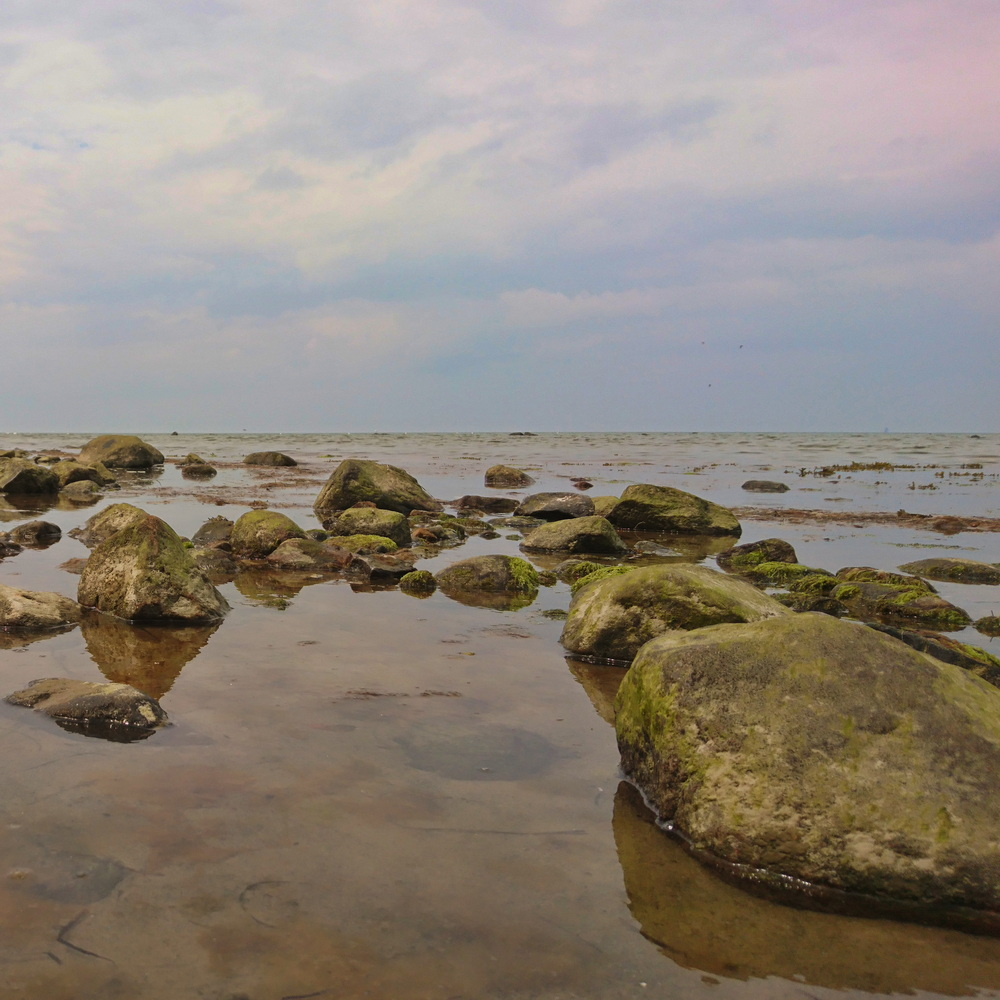
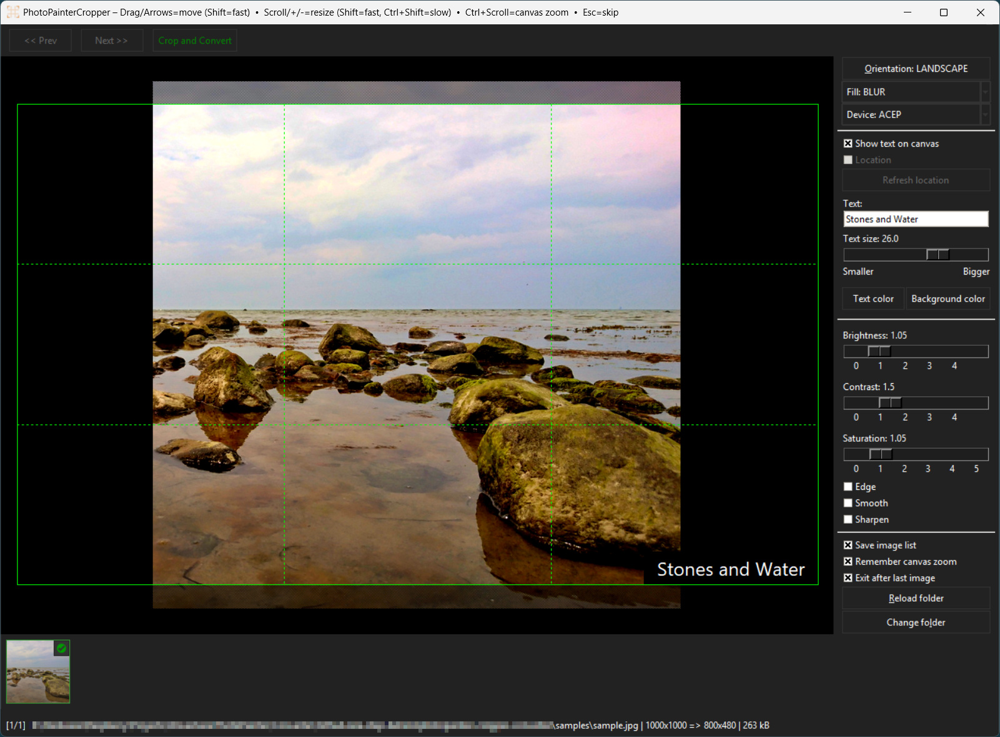
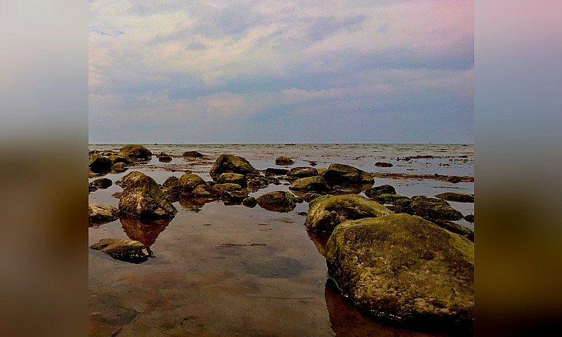
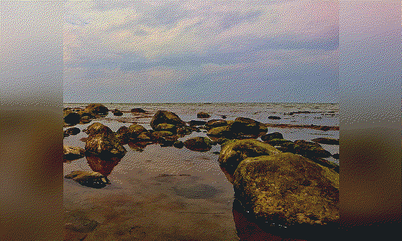
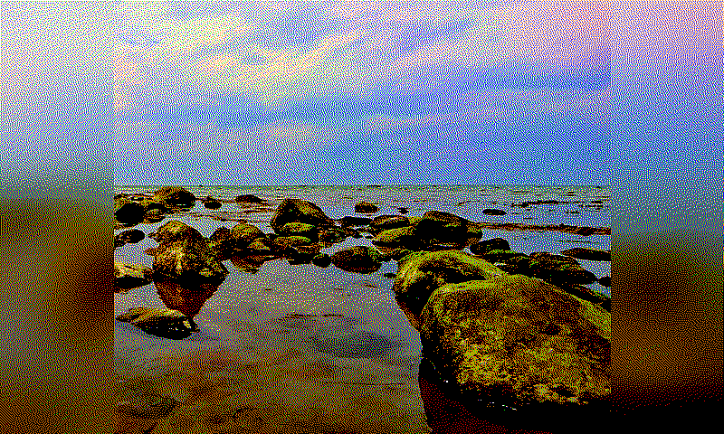
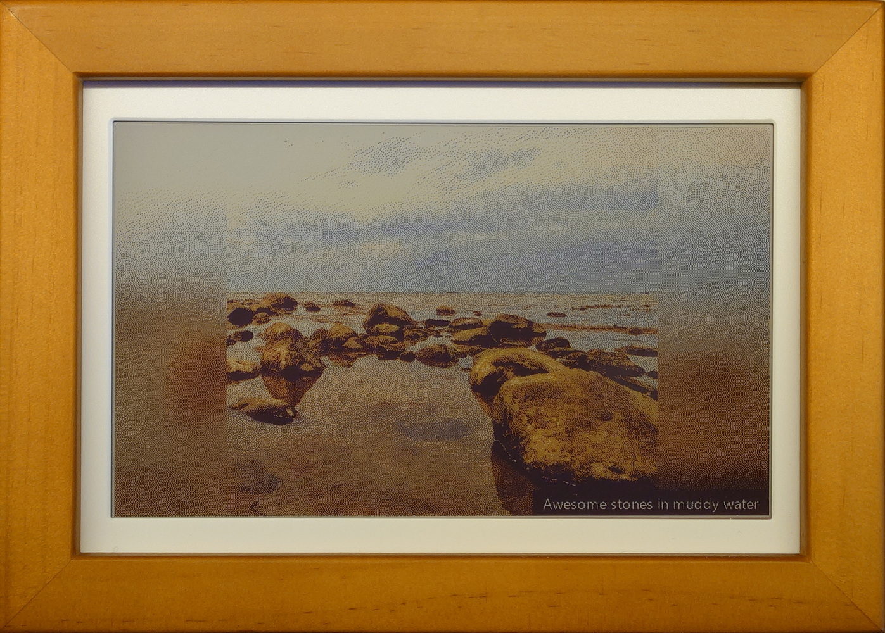

# PhotoPainter Cropper & Converter

Interactive image cropper and converter for the **Waveshare PhotoPainter** 7.3" ACeP and Spectra6 version.

This project is a fork of [@geegeek](https://github.com/geegeek)/[photopainter-cropper](https://github.com/geegeek/photopainter-cropper). Much improved for my own needs.

This tool helps to frame the primary subject of each photo within a specified folder, applying a fixed aspect ratio - such as 800×480 (landscape) or 480×800 (portrait) or any other user-defined target size. The crop rectangle can extend beyond the original image boundaries, and any resulting empty areas are automatically filled with either *white space* or a *blurred background* derived from the image itself.

Originally developed by **@geegeek** on **macOS** for personal workflow needs, this version here has been enhanced with additional capabilities. It works on Windows and Linux as well as it is written in Python.

## Key Features

- Supported image types: `.jpg`, `.jpeg`, `.png`, `.bmp`, `.gif`, `.tif`, `.tiff`, `.webp`, `.heic`*
- Load image by **EXIF** orientation
- Fixed **800x480** (landscape) or **480x800** (portrait) crop ratio
  — You can set the output dimensions via `image_target_size` in `settings.ini`
- **ACeP** or **Spectra6** optimized output
- **Image enhancements** to improve image quality: **Brightness**, **Contrast**, **Saturation**, **Edge**, **Smooth**, **Sharpen**
- Crop rectangle can **exceed image bounds** and empty areas will be filled with **White** or **Blur** background
- **Per-image state**: A `*_ppcrop.txt` sidecar file (configurable via the `state_suffix` parameter in `settings.ini`) is saved alongside each original image to persist all per-image settings - such as orientation, fill mode, target device, crop dimensions, enhancement values, ... - allowing the application to automatically restore the exact crop rectangle on subsequent runs, which is especially beneficial for large batch workflows
- App and some image properties configuration via `settings.ini` file (see **Settings** section)
- Crisp **crop area grid lines** aligned to device pixels
- (optional) **Generate fileList.txt** on app exit

\* HEIC support needs `pillow-heif` installed alongside `Pillow`. If you installed pip requirements this should be already the case.

## How it works

A sample image:

<figure class="align-center">

</figure>

...cropped beyond the border:

<figure class="align-center">

</figure>

...becomes this image as JPG:

<figure class="align-center">

</figure>

...converts to a dithered BMP:

<figure class="align-center">

</figure>

...and finally maps to a device specific color palette (Waveshare PhotoPainter Pico ACeP 7-color) which looks much punchier on your computer screen:
<figure class="align-center">

</figure>

...but much right when displayed on the PhotoPainter e-Paper device itself:
<figure class="align-center">

</figure>

## How to use

**Start the app** and select the folder with the images you want to convert.

Use **mouse/keyboard** to position and size the crop rectangle.

- **Mouse**:
  - Drag to move
  - Scroll to resize (hold **Shift** = faster)
- **Keyboard**:
  - Arrows = move (hold **Shift** = faster)
  - `+` / `-` = resize (hold **Shift** = faster)
  - **O** = toggle orientation (Landscape ↔ Portrait)
  - **F** = toggle fill (White ↔ Blur)
  - **D** = toggle device (ACeP ↔ Spectra6)
  - **ESC** = skip current image
  - **PAGE_UP** = previous image without processing current image
  - **PAGE_DOWN** = next image without processing current image
  - **Enter** or **S** = process & save current image and go to next

Optionally apply some **image optimizations** if you you want.

Use **Enter** or **S** to crop and convert the image.

- **Cropped JPGs** are saved to `cropped_[landscape|portrait]` next to your originals
- **Converted BMP** images are saved to `cropped_[landscape|portrait]/dithered` next to your originals
- **Converted Real-color BMP** images are saved to `cropped_[landscape|portrait]/dithered/pic_[acep|spectra6]` next to your originals

**Copy** the converted images to your SD card's `pic` folder.

## Why all these steps?

This app does the following:

1. **Scale and Crop**
   — In the first step, the app exports to **JPG 800×480** (landscape) or **480x800** (portrait) by setting the direction in the app.
2. **Convert JPG → 24-bit BMP**
   — In the second step the image will be dithered with the Floyd-Steinberg dithering algorithm and saved in a subfolder.
3. **Convert 24-bit BMP → Real world ePaper Screen RGB**
   — For the final 24-bit BMP device format, it uses part of a Gist by **@quark-zju** with color maps from [epdoptimize](https://github.com/Utzel-Butzel/epdoptimize). It provides way better color/tonal results on the 6- and 7-color panels than a plain BMP export by the original Waveshare converter.

Using the direct BMP export of the original Waveshare converter that follows the device format by using the suggested 6-/7-color palette is rendering the images to look a bit **flat** on the device, somehow like a "vintage" filter. This app applies **dithering** and (kind of) **device calibrated color mapping**. The result **looks way better** on the PhotoPainter device than the export of the original Waveshare converter.

## Samples and Outputs included

- Example **input** photo and **outputs** from this tool (JPG 800×480) are available in `sample` folder.
- For convenience, this repository also includes a **BMP file** in `sample/cropped_landscape/dithered/pic_acep` folder created with this converter, so you can copy it directly to the device.

## Settings (`settings.ini`)

*"With great power comes great responsibility."*

If it's not existing, the `settings.ini` file will be automatically created the first time after closing the app properly. The next time closing the app, this fill will be updated.

Available default settings:

```text
window_min=1280x960
image_target_size=800x480
image_quality=90
orientation=landscape
fill_mode=blur
target_device=acep
enhancer_edge=False
enhancer_smooth=True
enhancer_sharpen=False
grid_color=#00ff00
export_folder=cropped
state_suffix=_ppcrop.txt
convert_folder=dithered
raw_folder=raw
export_raw=False
pic_folder_on_device=pic
save_filelist=True
exit_after_last_image=True
```

## Device SD Card layout

- Create a folder named `pic` at the **root** of the SD card.
- Copy all **24-bit BMP** files from your desired target device folder (e.g. `pic_acep`) into the `pic` folder.
- Stock firmware expects fewer than ~100 images in `pic` folder.
- I personally use a **custom firmware** for my 7-color ACeP version, a mix of the official Waveshare firmware with improvements from @myevit made for the Spectra6 firmware which supports nearly **unlimited photos** in theory. Practically it has *"a reasonable limit to prevent memory issues"* of **100.000** photos on the SD Card.

## Install & Run

Clone repo:

```bash
git clone https://github.com/one-step-behind/photopainter-cropper-converter.git
```

### MacOS

Use the **official** Python for macOS (includes Tkinter).

```bash
/Library/Frameworks/Python.framework/Versions/3.12/bin/python3 -m venv ~/ppainter-venv
source ~/ppainter-venv/bin/activate
python -m pip install --upgrade pip
pip install -r requirements.txt
```

```bash
source ~/ppainter-venv/bin/activate
python photo_painter_cropper.py
```

### Windows

Virtual environment & installing requirements:

```bash
cd photopainter-cropper-converter
# create virtual environment for project (also creates folder by name)
python -m venv .venv
# create .venv\.gitignore with content "*"
# install and update PIP
python -m pip install --upgrade pip
# activate venv and install requirements
.\.venv\Scripts\activate
# it now says:
# (.venv) PS path\to\photopainter-cropper-converter>
# install requirements
python -m pip install -r requirements.txt
```

Run script:

```bash
# run script
python photo_painter_cropper.py

# VSCode
1. `Ctrl+Shift+P`
2. enter "Python: Select Interpreter"
3. select ".\.venv\Scripts\python.exe"
4. click Run button to run the script
```

You can create a standalone executable with pyinstaller:

```bash
# build executable first time and auto-generate `.spec` file
pyinstaller --onefile --windowed -i='.\_source\icon.ico' --add-data "_source/icon.ico;_source" --name "PhotoPainterCropper" ".\photo_painter_cropper.py"
# later you can run compilation with just:
pyinstaller PhotoPainterCropper.spec
```

Quit virtual env:

```bash
# quit venv
deactivate
```

## Project Type (GitHub Topics)

Desktop GUI **application** (Tkinter) for macOS, Windows and Linux. Suggested topics:
`app`, `desktop`, `gui`, `tkinter`, `pillow`, `macos`, `windows`, `image-processing`, `waveshare`, `photopainter`, `e-paper`, `acep`, `spectra6`, `cropper`, `converter`.

## References

- Waveshare [PhotoPainter wiki](https://www.waveshare.com/wiki/PhotoPainter) (specs, formats, conversion tools)
- **Official JPEG→BMP converter** [@waveshareteam](https://github.com/waveshareteam)/[PhotoPainter_B](https://github.com/waveshareteam/PhotoPainter_B)
- **UI/App** forked from [@geegeek](https://github.com/geegeek)/[photopainter-cropper](https://github.com/geegeek/photopainter-cropper)
- inspired by the image processor Gist from [@quark-zju](https://gist.github.com/quark-zju)/[epd-dither-resize-spectra6.py](https://gist.github.com/quark-zju/e488eb206ba66925dc23692170ba49f9) which is a fork of Waveshare's original ConverTo6c_bmp-7.3 converter
- Usage of [device color palettes](https://github.com/Utzel-Butzel/epdoptimize/blob/main/src/dither/data/default-palettes.json) from [@Utzel-Butzel](https://github.com/Utzel-Butzel)/[epdoptimize](https://github.com/Utzel-Butzel/epdoptimize/)
- Custom **firmware** by [@myevit](https://github.com/myevit)/[PhotoPainter_B](https://github.com/myevit/PhotoPainter_B) (adapted to the Photopainter RP2040 **ACeP** version by myself) — real random photos from up to **100.000** files on your SD Card

## License & Credits

- License: **MIT**
- Not affiliated with Waveshare. All trademarks belong to their owners.
- Firmware credit: **@myevit** (see link above).
