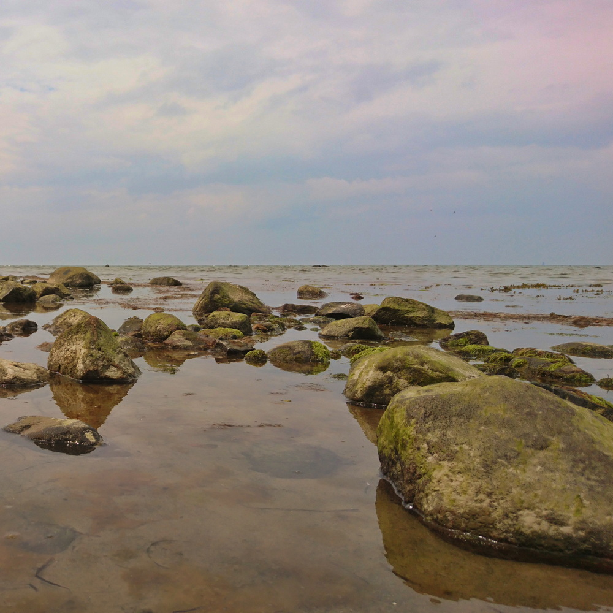
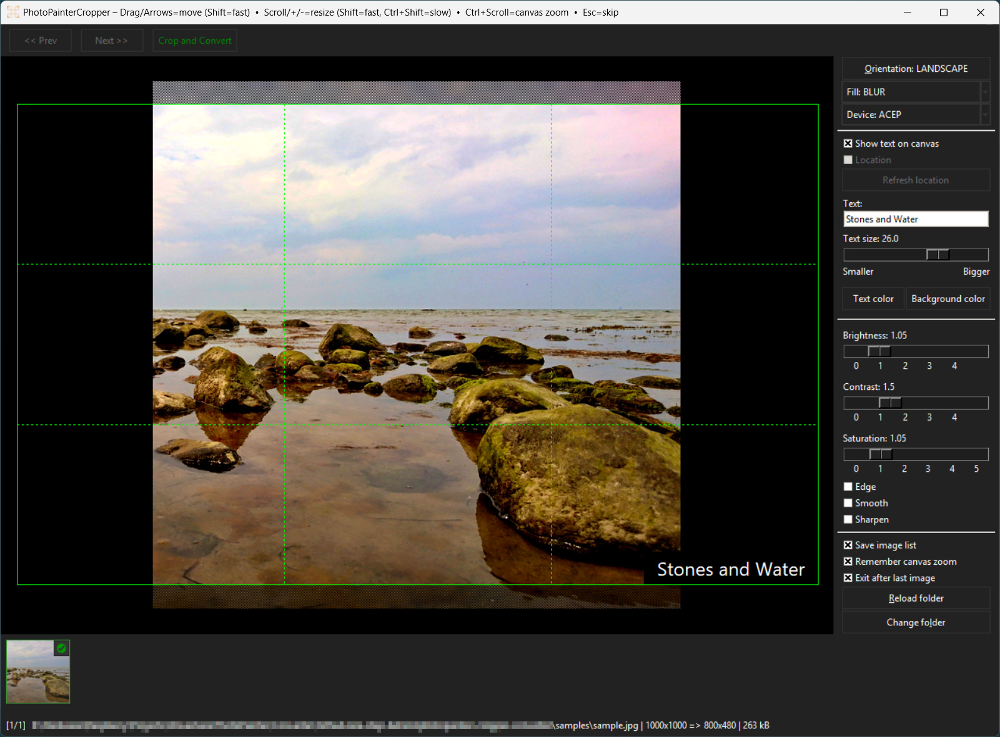
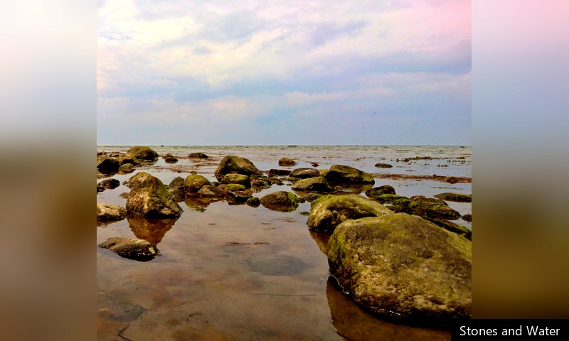
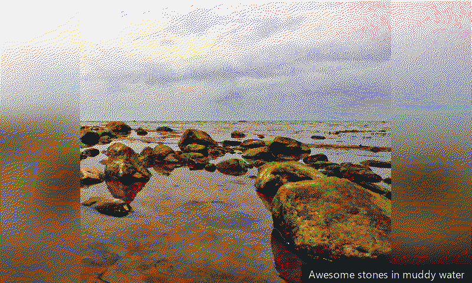
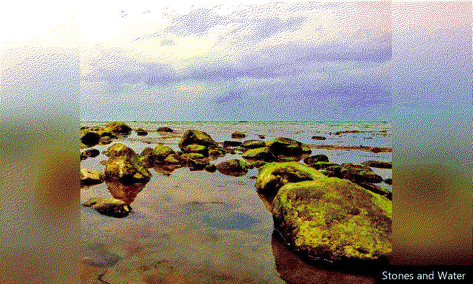
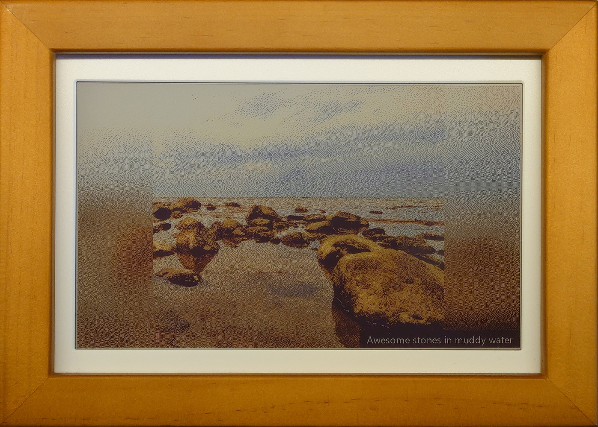

# PhotoPainter Cropper & Converter

Interactive image cropper and converter for the **Waveshare PhotoPainter**7.3" ACeP (A) and Spectra6 (B) version.

The **PhotoPainter Cropper & Converter** helps you to frame the primary subject of each photo within a specified folder, applying a given target size mainly for the mentioned device above with 800×480 or any other user-defined target size. The crop rectangle can extend beyond the original image boundaries, and any resulting empty areas are automatically filled with either *white space* or a *blurred background* derived from the image itself.

This project is an enhanced (much improved for my own needs) version of an image crop & convert application based on the idea from [@geegeek](https://github.com/geegeek)/[photopainter-cropper](https://github.com/geegeek/photopainter-cropper). It eases the workflow to convert photos into a format that the Waveshare PhotoPainter can handle. It works on MacOS, Windows and Linux which has **Python3** and **Tkinter** installed.

## Key Features

- Supported image types: `.jpg`, `.jpeg`, `.png`, `.bmp`, `.gif`, `.tif`, `.tiff`, `.webp`, `.heic`*
- Load image by **EXIF** orientation
- Fixed **800x480** (landscape) or **480x800** (portrait) crop ratio
  — You can set the output dimensions via `image_target_size` in `settings.ini`
- **ACeP** or **Spectra6** optimized output
- **Image enhancements** — Brightness, Contrast, Saturation, Edge, Smooth, Sharpen (Brightness, Contrast and Sharpening can introduce visual artifacts in the converted image)
- Crop rectangle can **exceed image bounds** and empty areas will be filled with **White**, **Black** or **Blur** background
- Add a user defined **text** or **Geolocation** automatically retrieved from EXIF geo-coordinates if available in image
- **Per-image state**
  — A `*_ppcrop.txt` sidecar file (configurable via the `state_suffix` parameter in `settings.ini`) is saved alongside each original image to persist all per-image settings allowing the application to automatically restore the exact crop rectangle and settings on subsequent runs
- App and some image **properties configuration** via `settings.ini` file (see **Settings** section)
- Crisp **crop area grid lines** aligned to device pixels
- (optional) **Generate fileList.txt** on app exit
  — useful for original firmware *Mode 2* or custom firmware which uses this file to retrieve image list (mostly named as *Mode 3*)

\* HEIC support needs `pillow-heif` installed alongside `Pillow`. If you're following the **Install & Run** section below you should be all set.

## How it works

A sample image:



...cropped beyond the border:



...becomes this image as JPG:



...converts to a dithered BMP:



...and finally maps to a device specific color palette (Waveshare PhotoPainter Pico ACeP 7-color) which looks much punchier on your computer screen:



...but much right when displayed on the PhotoPainter e-Paper device itself:



## How to use

1. **Start the app** and select the folder with the images you want to convert.

2. Use **mouse/keyboard** to position and size the crop rectangle and modify.

   - **Mouse**:
     - Drag to move
     - Scroll to resize (hold **Shift** = faster, **Ctrl**+**Shift** = slower)
     - `Ctrl`+Scroll to zoom canvas
   - **Keyboard**:
     - `↑`, `↓`, `←`, `→` = move (hold **Shift** = faster)
     - `+` / `-` = resize (hold **Shift** = faster, **Ctrl**+**Shift** = slower)
     - `Ctrl`+`O` = toggle orientation (Landscape ↔ Portrait)
     - `Ctrl`+`F` = toggle fill (Blur ↔ White ↔ Black)
     - `Ctrl`+`D` = toggle device (ACeP ↔ Spectra6 ↔ 4-color)
     - `Ctrl`+`1` = Edge enhancement
     - `Ctrl`+`2` = Smooth image
     - `Ctrl`+`3` = Sharpen image
     - `ESC` = skip current image
     - `PAGE_UP` = previous image without processing current image
     - `PAGE_DOWN` = next image without processing current image
     - `Ctrl`+`A` = maximize and center crop marker
     - `Enter`, `Ctrl`+`S` = process & save current image and go to next
     - `Ctrl`+`Shift`+`S` = Toggle Saving image list to fileList.txt when app is closing
     - `Ctrl`+`Shift`+`Z` = Toggle Remember canvas zoom when app is closing
     - `Ctrl`+`Shift`+`X` = Toggle to automatically Exit the app after last image in folder was processed/skipped

   Optionally: apply **image optimizations** with sliders like *Brightness*, *Contrast*, *Saturation*.

3. Use **Enter**/**Ctrl+S** or click the "Crop and Convert" button at the top to crop and convert the image.

   - **Cropped JPGs** are saved to `cropped_[landscape|portrait]` next to your originals
   - **Converted BMP** images are saved to `cropped_[landscape|portrait]/dithered` next to your originals
   - **Converted Real-color BMP** images are saved to `cropped_[landscape|portrait]/dithered/pic_[acep|spectra6]` next to your originals

   The output folders can be set via `settings.ini` - see **Settings** section below.

4. **Copy** the converted images in `cropped_[landscape|portrait]/dithered/pic_[acep|spectra6]` to your SD card's `pic` folder and (if "Save image list" option was set) the fileList.txt from there to the root folder of the card.

5. **Insert** the SD card into the PhotoPainter and click the NEXT button on the back.

## Samples and Outputs included

For convenience, example **input** photos and **BMP outputs** created with this converter are available in `samples` folder. You can copy the BMP files in `samples/cropped_landscape/dithered/pic_acep` to your SD card's `pic` folder to try them out.

## Device SD Card layout

- Create a folder named `pic` at the **root** of the SD card.
- Copy all **24-bit BMP** files from your desired target device folder (e.g. `pic_acep`) into the `pic` folder.
- Stock firmware expects fewer than ~100 images in `pic` folder.
- I personally use a **custom firmware** for my 7-color ACeP version, a mix of the official Waveshare firmware with improvements from @myevit made for the Spectra6 firmware which supports nearly **unlimited photos** in theory. Practically it has *"a reasonable limit to prevent memory issues"* of **100.000** photos on the SD Card.

## Why all these convert steps?

Images need to be converted to a color palette that the device can display. The ACeP version has 7 colors: black, white, red, green, blue, yellow, orange. The Spectra6 (obviously) has 6 colors: black, white, red, green, blue, yellow.

This app does the following:

1. **Scale and Crop**
   — The app exports the marked area to **JPG 800×480** (landscape) or **480x800** (portrait). The output dimensions can be set in `settings.ini`. Orientation will be set per image in the app.
2. **Convert JPG → 24-bit BMP**
   — The image will be dithered with the Floyd-Steinberg dithering algorithm.
3. **Map 24-bit BMP → Real world ePaper Screen colors**
   — For the final 24-bit BMP device format, it uses part of a Gist by **@quark-zju** with color maps from [epdoptimize](https://github.com/Utzel-Butzel/epdoptimize). It provides way better color/tonal results on the 6- and 7-color panels than a plain BMP export by the original Waveshare converter.

Using the BMP export of the original Waveshare converter that follows the device format by using the suggested 6-/7-color palette is rendering the images to look a bit **flat** on the device, somehow like a "vintage" filter. This app applies **dithering** and (kind of) **device calibrated color mapping**. The result **looks way better** on the PhotoPainter device than the export of the original Waveshare converter.

## Settings (`settings.ini`)

*"With great power comes great responsibility."*

If it's not existing, the `settings.ini` file will be automatically created the first time after closing the app properly. The next time closing the app, this file will be updated.

Available settings and their defaults:

```ini
# PhotoPainter app state
window_min=1024x768        # minimum size of window
last_window_size=1024x768  # last window dimensions
last_window_position=10x10 # last window position
image_target_size=800x480  # exact JPG output image dimensions
image_quality=90           # quality of the JPG output
orientation=landscape      # landscape, portrait
fill_mode=blur             # blur, white
target_device=acep         # acep, spectra6
enhancer_edge=False        # default for Edge enhancer
enhancer_smooth=False      # default for Smooth enhancer
enhancer_sharpen=False     # default for Sharpen enhancer
grid_color=#00ff00         # rectangle border color
export_folder=cropped      # folder where to store cropped images
convert_folder=dithered    # folder where to store converted/dithered images
raw_folder=raw             # folder where to store raw images
pic_folder_on_device=pic   # first part of the folder for final image
state_suffix=_ppcrop.txt   # file extension for sidecar file
export_raw=False           # should export raw image suitable for direct use?
save_filelist=True         # save fileList.txt at app exit for both orientations
exit_after_last_image=True # exit app after last image was processed
save_canvas_zoom=True      # save canvas zoom at exit
canvas_zoom=0.83           # canvas zoom value
```

## Install & Run this project

If you are new to Python projects, follow only one OS section below.

### 1. Download the project

```bash
git clone https://github.com/one-step-behind/photopainter-cropper-converter.git
cd photopainter-cropper-converter
```

### 2. macOS

Use the official Python installer for macOS (it includes Tkinter).

Create and activate a virtual environment:

```bash
/Library/Frameworks/Python.framework/Versions/3.12/bin/python3 -m venv ~/ppainter-venv
source ~/ppainter-venv/bin/activate
python -m pip install --upgrade pip
```

Install this project as a package (recommended):

```bash
python -m pip install -e .
```

Start the app:

```bash
photopainter-cropper
```

Alternative start method (without package command):

```bash
python main.py
```

### 3. Windows (PowerShell)

Create and activate a virtual environment:

```powershell
python -m venv .venv
.\.venv\Scripts\Activate.ps1
python -m pip install --upgrade pip
```

Install this project as a package (recommended):

```powershell
python -m pip install -e .
```

Start the app:

```powershell
photopainter-cropper
```

Alternative start method (without package command):

```powershell
python main.py
```

VS Code quick setup:

1. Open Command Palette with `Ctrl+Shift+P`
2. Select `Python: Select Interpreter`
3. Choose `.venv\Scripts\python.exe`
4. Use `Run and Debug` with `PhotoPainterCropper (main.py)`

### 4. Linux

If needed (Debian/Ubuntu), install missing venv/tk packages first:

```bash
sudo apt install python3.12-venv
sudo apt-get install python3-tk
```

Create and activate a virtual environment:

```bash
python3 -m venv .venv
source .venv/bin/activate
python3 -m pip install --upgrade pip
```

Install this project as a package (recommended):

```bash
python3 -m pip install -e .
```

Start the app:

```bash
photopainter-cropper
```

Alternative start method (without package command):

```bash
python3 main.py
```

### Optional: build a standalone executable with PyInstaller

```bash
python -m pip install -e ".[build]"
pyinstaller --onefile --windowed -i='.\_source\icon.ico' --add-data "_source/icon.ico;_source" --add-data "_source/icon.png;_source" --add-data "_source/round_check_mark_16.png;_source" --name "PhotoPainterCropper" ".\main.py"
```

### Leave virtual environment

```bash
deactivate
```

## References

### Converter

- [Waveshare PhotoPainter Wiki](https://www.waveshare.com/wiki/PhotoPainter) (specs, formats, conversion tools)
- **Original Waveshare JPEG→BMP converter**: https://files.waveshare.com/upload/e/ea/ConverTo7c_bmp.zip
- **UI/App** forked from [@geegeek](https://github.com/geegeek)/[photopainter-cropper](https://github.com/geegeek/photopainter-cropper)
- inspired by the image processor Gist from [@quark-zju](https://gist.github.com/quark-zju)/[epd-dither-resize-spectra6.py](https://gist.github.com/quark-zju/e488eb206ba66925dc23692170ba49f9) which is a fork of Waveshare's original ConverTo6c_bmp-7.3 converter (Spectra6 6-color version!)
- Usage of [device color palettes](https://github.com/Utzel-Butzel/epdoptimize/blob/main/src/dither/data/default-palettes.json) from [@Utzel-Butzel](https://github.com/Utzel-Butzel)/[epdoptimize](https://github.com/Utzel-Butzel/epdoptimize/)
- [HEIC support](https://github.com/myevit/PhotoPainter_image_converter/blob/main/convert.py#L21) taken from [@myevit](https://github.com/myevit)/[PhotoPainter_image_converter](https://github.com/myevit/PhotoPainter_image_converter)

### Firmware

- Original [@waveshareteam](https://github.com/waveshareteam)/[PhotoPainter (A)](https://github.com/waveshareteam/PhotoPainter) firmware
- I'm using a custom firmware adapted from [@myevit](https://github.com/myevit)/[PhotoPainter_B](https://github.com/myevit/PhotoPainter_B) to the Photopainter RP2040 **ACeP** version by myself — real random photos out of up to **100.000 files** on the SD Card

## License & Credits

- License: **MIT**
- Not affiliated with Waveshare. All trademarks belong to their owners.
- Firmware credit: **@myevit** (see link above).
